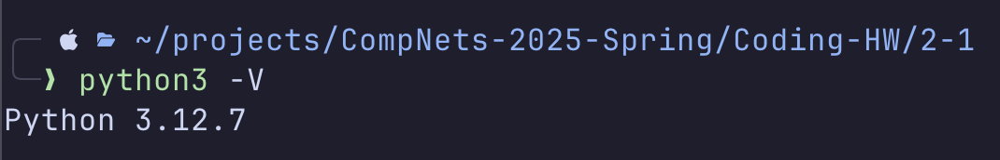
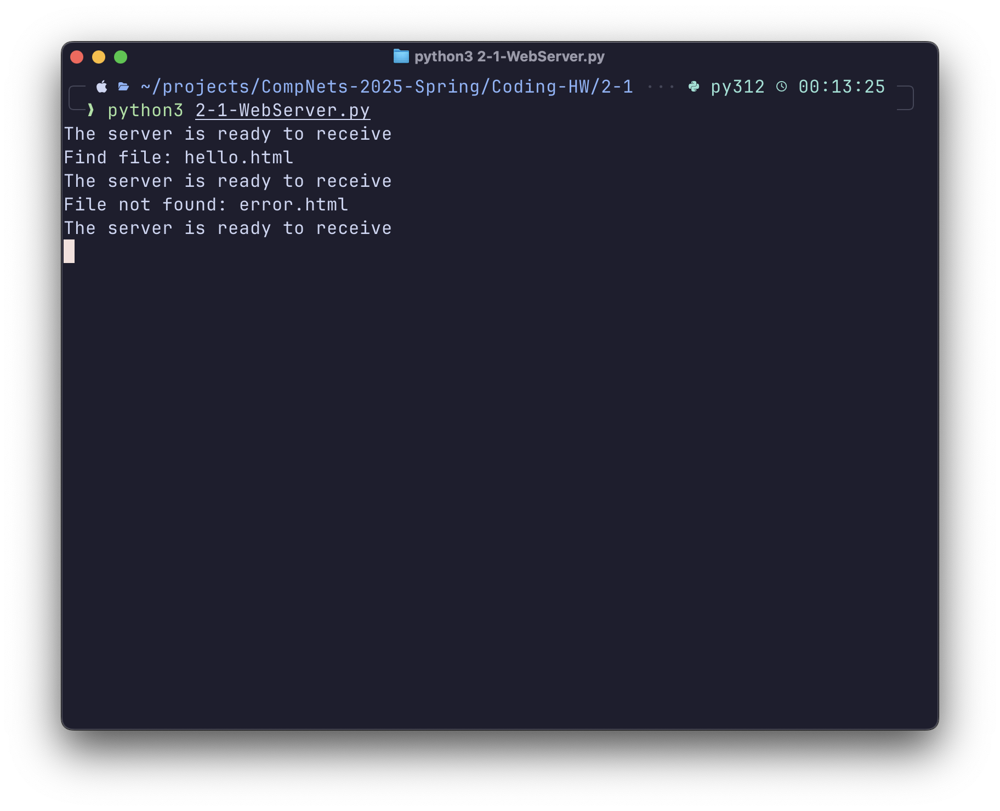
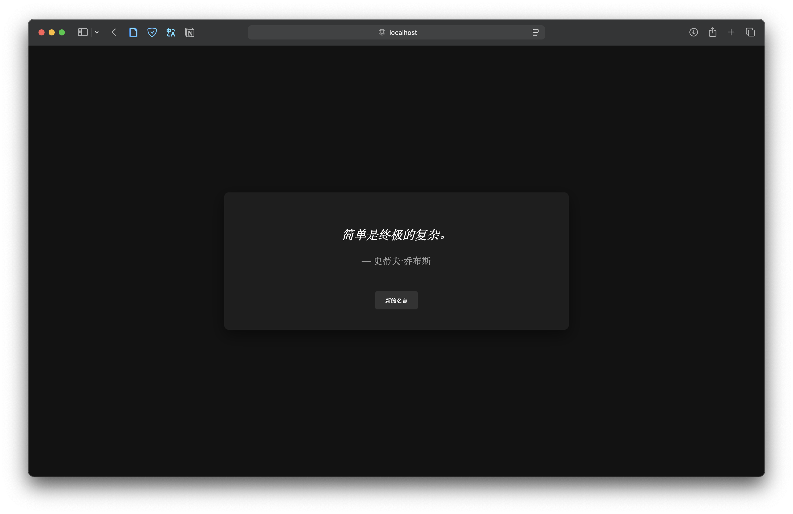
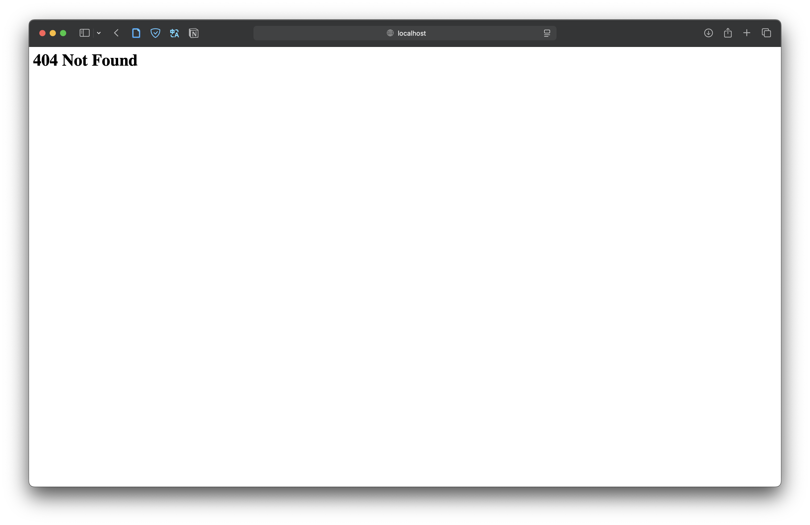
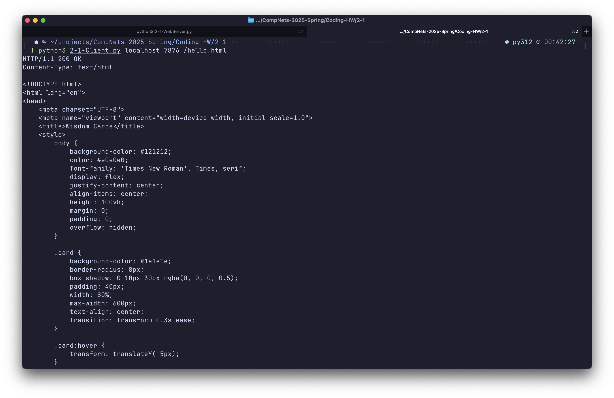
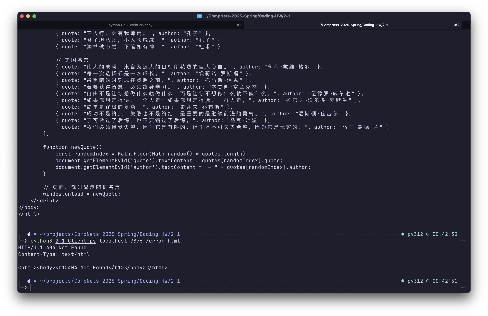

# 编程2-1运行结果报告

汪琦 2023010905015

**Python版本：**3.12.7

**浏览器类型：**Safari

**Web服务器运行截图：**

**任务2的客户端浏览器窗口：**

- **请求服务器上存在的文件：**

  

- **请求服务器上不存在的文件：**

  

**任务4的HTTP客户端程序运行窗口：**

- **请求服务器上存在的文件：**

  

- **请求服务器上不存在的文件：**

  
**AI工具使用声明：**测试时使用的 `hello.html` 页面为 AI 生成。编写代码时，我使用了 AI 来帮助我理解框架代码。