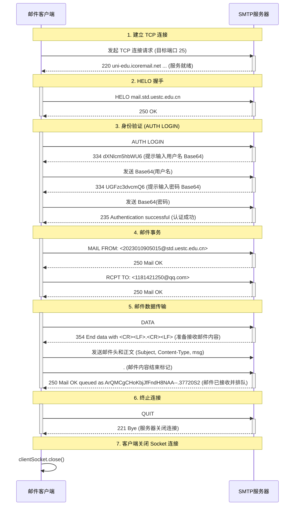

# 套接字编程作业 2-3 运行结果报告

## Python 版本

3.12.7

## 交互时序图

```mermaid
sequenceDiagram
    participant Client as 邮件客户端
    participant Server as SMTP服务器

    Note over Client,Server: 1. 建立 TCP 连接
    Client->>Server: 发起 TCP 连接请求 (目标端口 25)
    activate Server
    Server-->>Client: 220 uni-edu.icoremail.net ... (服务就绪)
    deactivate Server

    Note over Client,Server: 2. HELO 握手
    activate Client
    Client->>Server: HELO mail.std.uestc.edu.cn
    activate Server
    Server-->>Client: 250 OK
    deactivate Server
    deactivate Client

    Note over Client,Server: 3. 身份验证 (AUTH LOGIN)
    activate Client
    Client->>Server: AUTH LOGIN
    activate Server
    Server-->>Client: 334 dXNlcm5hbWU6 (提示输入用户名 Base64)
    deactivate Server
    Client->>Server: 发送 Base64(用户名)
    activate Server
    Server-->>Client: 334 UGFzc3dvcmQ6 (提示输入密码 Base64)
    deactivate Server
    Client->>Server: 发送 Base64(密码)
    activate Server
    Server-->>Client: 235 Authentication successful (认证成功)
    deactivate Server
    deactivate Client

    Note over Client,Server: 4. 邮件事务
    activate Client
    Client->>Server: MAIL FROM: <2023010905015@std.uestc.edu.cn>
    activate Server
    Server-->>Client: 250 Mail OK
    deactivate Server
    Client->>Server: RCPT TO: <1181421250@qq.com>
    activate Server
    Server-->>Client: 250 Mail OK
    deactivate Server
    deactivate Client

    Note over Client,Server: 5. 邮件数据传输
    activate Client
    Client->>Server: DATA
    activate Server
    Server-->>Client: 354 End data with <CR><LF>.<CR><LF> (准备接收邮件内容)
    deactivate Server
    Client->>Server: 发送邮件头和正文 (Subject, Content-Type, msg)
    Client->>Server: . (邮件内容结束标记)
    activate Server
    Server-->>Client: 250 Mail OK queued as ArQMCgCHoKbjJfFndH8NAA--.37720S2 (邮件已接收并排队)
    deactivate Server
    deactivate Client

    Note over Client,Server: 6. 终止连接
    activate Client
    Client->>Server: QUIT
    activate Server
    Server-->>Client: 221 Bye (服务器关闭连接)
    deactivate Server
    deactivate Client

    Note over Client,Server: 7. 客户端关闭 Socket 连接
    Client->>Client: clientSocket.close()
```

## 邮件客户端程序运行窗口截图

## 发件人邮箱的已发送文件夹中这封被发送的邮件截图

我们在Python脚本中是没有实现将邮件副本保存到已发送信箱功能的，但是邮件服务提供商一般会有相关选项帮助我们完成这一行为。

## 收件人邮箱的收件箱中这封被发送的邮件截图

